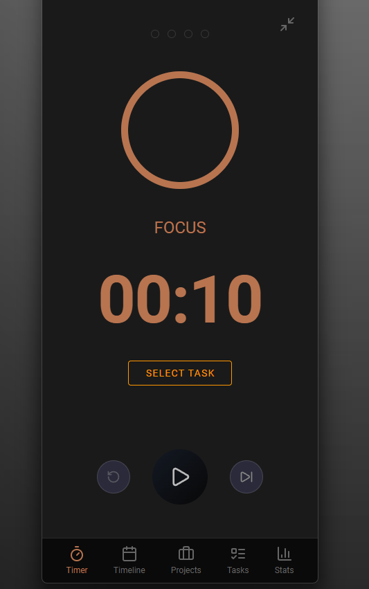

# Pomodo

A cross-platform Pomodoro timer for Desktop, Android, and iOS.

## Features

- **Pomodoro Timer** - Configurable focus and break sessions with long break intervals
- **Task & Project Management** - Organize focus sessions by tasks and projects
- **Statistics** - Weekly overview with focus heatmaps, streaks, and total focus hours
- **Mini Mode** - Compact always-on-top window for unobtrusive focus tracking
- **Theme Support** - Light and dark mode with system preference detection

## Screenshots

## Download

### Mobile

| Platform | Link |
|----------|------|
| iOS | [App Store](#) |
| Android | [Google Play](#) |

### Desktop

| Platform | Link |
|----------|------|
| Windows | [Download .exe](#) |
| macOS | [Download .dmg](#) |
| Linux (AUR) | `yay -S pomodo` *(coming soon)* |

## Support

Having issues? Found a bug?

- [Report an issue](https://github.com/Samu-K/pomodo/issues)
- [Contact support](#)

## Privacy

Pomodo works entirely offline by default—all data stays on your device. If you choose to create an account, you can enable cloud sync to back up your data and access it across devices. No account is required to use the app.

## License

FSL-1.1-MIT. See [LICENSE.md](LICENSE.md) for details.
